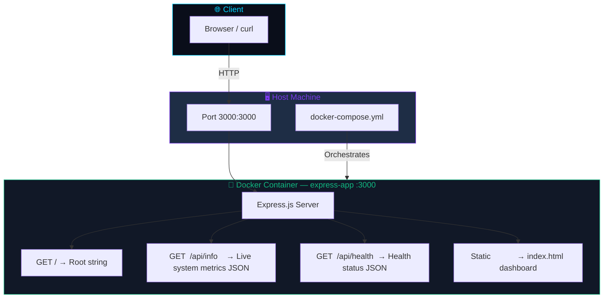
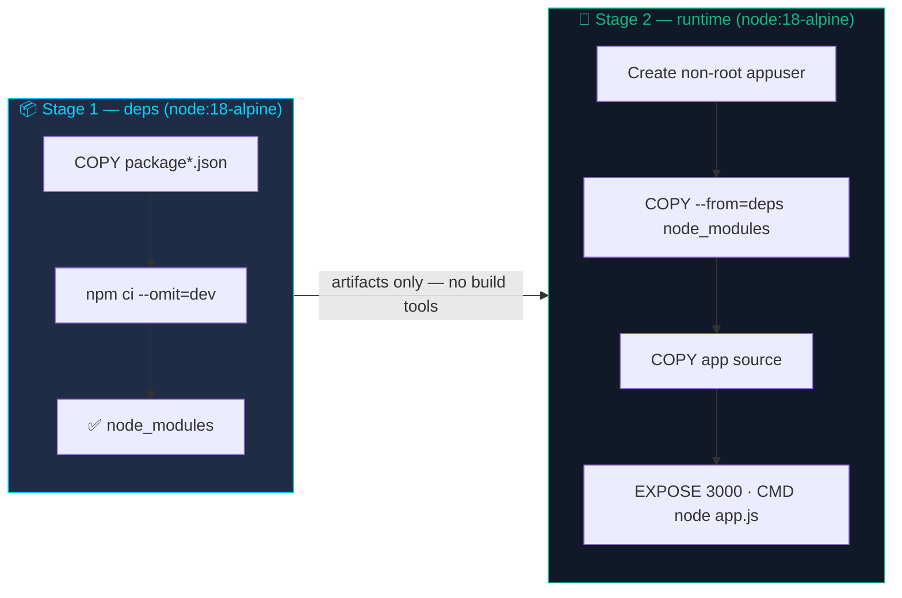

<div align="center">


[](https://nodejs.org/)
[](https://expressjs.com/)
[](https://www.docker.com/)
[](https://docs.docker.com/compose/)
[](https://alpinelinux.org/)
[]()
[](LICENSE)

> 🚀 A production-hardened **Node.js + Express** app containerized with **Docker multi-stage builds**, live system metrics API, animated dashboard UI, health checks, and non-root security — deployable in one command.

[⚡ Quick Start](#-quick-start) · [🏗️ Architecture](#️-architecture) · [📁 Project Structure](#-project-structure) · [📡 API Docs](#-api-documentation) · [🔒 Security](#-security) · [🛠️ Troubleshooting](#️-troubleshooting)

</div>

---

## 📋 Table of Contents

- [⚡ Quick Start](#-quick-start)
- [🏗️ Architecture](#️-architecture)
- [📁 Project Structure](#-project-structure)
- [🧰 Tech Stack](#-tech-stack)
- [🌍 Environment Variables](#-environment-variables)
- [✅ Prerequisites](#-prerequisites)
- [💻 Run Locally](#-run-locally)
- [🐳 Docker Deployment](#-docker-deployment)
- [📡 API Documentation](#-api-documentation)
- [🔒 Security](#-security)
- [📊 Logs & Monitoring](#-logs--monitoring)
- [🛠️ Troubleshooting](#️-troubleshooting)
- [👤 Author](#-author)

---

## ⚡ Quick Start

```bash
git clone https://github.com/your-username/docker-express-app.git
cd docker-express-app
docker compose up --build
```

Open **http://localhost:3000** — done. 🎉

---

## 🏗️ Architecture



### Multi-Stage Docker Build



> **Why multi-stage?** The final image ships **zero build tools** — only the Alpine runtime, production `node_modules`, and your source. ~60% smaller than a single-stage build.

---

## 📁 Project Structure

```
docker-express-app/
│
├── 📄 app.js               ← Express server — routes, API logic, static serving
├── 🌐 index.html           ← Animated dark-mode dashboard (vanilla HTML/CSS/JS)
├── 🐳 Dockerfile           ← Two-stage build: deps → hardened runtime image
├── 🐙 docker-compose.yml   ← Service definition, port mapping, health check
├── 🚫 .dockerignore        ← Excludes node_modules, .env, .git from build context
├── 📦 package.json         ← Dependencies (express 4.18.2), npm scripts
└── 🔒 package-lock.json    ← Exact dependency lockfile used by npm ci
```

### Key File Interactions

| File | Role | Talks To |
|---|---|---|
| `app.js` | Entry point — starts server on `:3000`, registers all routes | `index.html` (static), `os` module (metrics) |
| `index.html` | Dashboard — fetches `/api/info` on load, renders stat cards | `app.js` via `fetch('/api/info')` |
| `Dockerfile` | Builds the container image in two stages | `package.json`, `app.js`, `index.html` |
| `docker-compose.yml` | Declares the `web` service, port `3000:3000`, env vars, health check | `Dockerfile` (via `build.context`) |
| `.dockerignore` | Keeps secrets and junk out of the Docker build context | `docker build` reads it automatically |
| `package-lock.json` | Pins every transitive dep to an exact version + integrity hash | Used exclusively by `npm ci` in Stage 1 |

---

## 🧰 Tech Stack

| Layer | Technology | Version | Purpose |
|---|---|---|---|
| Runtime | Node.js | 18 LTS | JavaScript execution environment |
| Framework | Express.js | 4.18.2 | HTTP routing, middleware, static file serving |
| Frontend | Vanilla HTML/CSS/JS | — | Self-contained dashboard, no build step |
| Container | Docker (multi-stage) | 20+ | Image build, packaging, isolation |
| Orchestration | Docker Compose | v3 | Service lifecycle, env vars, health checks |
| Base OS | Alpine Linux | via node:18-alpine | ~5 MB minimal OS, reduced CVE surface |

---

## 🌍 Environment Variables

| Variable | Description | Default |
|---|---|---|
| `NODE_ENV` | Express runtime mode — `production` disables error stack traces | `development` |
| `CONTAINERIZED` | Custom flag returned by `/api/info` to signal container context | `false` |

Both are set in `docker-compose.yml`:

```yaml
environment:
  - NODE_ENV=production
  - CONTAINERIZED=true
```

Or pass them with `docker run`:

```bash
docker run -e NODE_ENV=production -e CONTAINERIZED=true -p 3000:3000 docker-express-app
```

> ⚠️ Never commit `.env` files — they are excluded via `.dockerignore`.

---

## ✅ Prerequisites

| Tool | Version | Install |
|---|---|---|
| Docker | 20+ | [docs.docker.com/get-docker](https://docs.docker.com/get-docker/) |
| Docker Compose | v2 (bundled) | Included with Docker Desktop |
| Node.js | 18 LTS | [nodejs.org](https://nodejs.org/) *(only for local run without Docker)* |

Verify:

```bash
docker --version          # Docker version 20.x.x
docker compose version    # Docker Compose version v2.x.x
node --version            # v18.x.x  (optional — for local run)
```

---

## 💻 Run Locally

Without Docker — runs directly on your machine:

```bash
# Install dependencies
npm install

# Start server
npm start
# → 🚀 Server running on http://0.0.0.0:3000
```

Verify:

```bash
curl http://localhost:3000/api/health
# {"status":"ok","timestamp":"..."}
```

---

## 🐳 Docker Deployment

### Docker Compose (Recommended)

```bash
# Build image + start container
docker compose up --build

# Run in background
docker compose up --build -d

# View live logs
docker compose logs -f web

# Stop and remove containers
docker compose down
```

### Raw Docker Commands

```bash
# Build the image
docker build -t docker-express-app .

# Run the container
docker run -d \
  --name express-app \
  -p 3000:3000 \
  -e NODE_ENV=production \
  -e CONTAINERIZED=true \
  --restart unless-stopped \
  docker-express-app

# Confirm healthy status
docker ps
# express-app   Up 2 min (healthy)   0.0.0.0:3000->3000/tcp
```

### Useful Docker Commands

```bash
# Shell into running container
docker exec -it express-app sh

# Check health check history
docker inspect --format='{{json .State.Health}}' express-app | jq .

# Live CPU + memory stats
docker stats express-app

# Rebuild with zero cache
docker compose build --no-cache && docker compose up -d
```

---

## 📡 API Documentation

Base URL: `http://localhost:3000`

| Method | Endpoint | Description |
|---|---|---|
| `GET` | `/` | Root liveness string |
| `GET` | `/api/health` | Health probe (polled by Docker every 30s) |
| `GET` | `/api/info` | Live container system metrics |
| `GET` | `/*` | Serves `index.html` dashboard |

---

### `GET /api/health`

```bash
curl http://localhost:3000/api/health
```

```json
{
  "status": "ok",
  "timestamp": "2026-04-17T16:23:00.000Z"
}
```

---

### `GET /api/info`

```bash
curl http://localhost:3000/api/info
```

```json
{
  "hostname": "a1b2c3d4e5f6",
  "platform": "linux",
  "nodeVersion": "v18.20.2",
  "uptime": 142,
  "memory": {
    "total": 7872,
    "free": 5310
  },
  "environment": "production",
  "containerized": "true"
}
```

| Field | Source | Notes |
|---|---|---|
| `hostname` | `os.hostname()` | Docker sets this to the short container ID |
| `platform` | `os.platform()` | Always `linux` inside Docker |
| `nodeVersion` | `process.version` | Node.js runtime version |
| `uptime` | `process.uptime()` | Seconds since process start |
| `memory.total/free` | `os.totalmem/freemem()` | MB — reflects container memory limits |
| `containerized` | `process.env.CONTAINERIZED` | `"true"` when running in Docker |

---

## 🔒 Security

| Practice | Implementation |
|---|---|
| **Non-root user** | `adduser appuser` + `USER appuser` in Dockerfile — container never runs as root |
| **Multi-stage build** | Final image has no npm, no shell extras, no devDependencies |
| **`.dockerignore`** | Excludes `.env`, `.git`, `node_modules` — secrets never reach the image |
| **Alpine base** | `node:18-alpine` — minimal OS, significantly smaller CVE surface |
| **Pinned lockfile** | `npm ci` + `package-lock.json` — reproducible, tamper-evident installs |
| **Health check** | Docker polls `/api/health` every 30s; restarts unhealthy containers |

### Dockerfile Security Snippet

```dockerfile
# Non-root user
RUN addgroup -S appgroup && adduser -S appuser -G appgroup
RUN chown -R appuser:appgroup /app
USER appuser

# Health check
HEALTHCHECK --interval=30s --timeout=10s --retries=3 \
  CMD curl -f http://localhost:3000/api/health || exit 1
```

### Recommended: Trivy Image Scan

```bash
# Scan for CVEs before pushing to registry
trivy image docker-express-app

# Fail CI on HIGH/CRITICAL vulnerabilities
trivy image --exit-code 1 --severity HIGH,CRITICAL docker-express-app
```

---

## 📊 Logs & Monitoring

```bash
# Follow live logs
docker logs -f express-app

# Last 50 lines with timestamps
docker logs -t --tail 50 express-app

# Live resource usage
docker stats express-app

# Inspect health check results
docker inspect --format='{{json .State.Health.Log}}' express-app | jq .
```

Expected healthy log entry:

```json
{ "ExitCode": 0, "Output": "", "Start": "2026-04-17T16:23:30Z" }
```

---

## 🛠️ Troubleshooting

| Problem | Cause | Fix |
|---|---|---|
| `address already in use :::3000` | Port 3000 occupied on host | `lsof -ti:3000 \| xargs kill -9` or change host port to `3001:3000` |
| Container shows `(unhealthy)` | `/api/health` not responding | `docker logs express-app` → `docker exec express-app curl localhost:3000/api/health` |
| `npm ERR! missing package-lock.json` | Lockfile not committed | Run `npm install` locally, commit `package-lock.json`, rebuild |
| `EACCES permission denied` | File ownership not set in Dockerfile | Confirm `chown -R appuser:appgroup /app` is present before `USER appuser` |
| Code changes not reflected | Docker used cached layer | `docker compose build --no-cache && docker compose up -d` |
| `docker compose: command not found` | Older Docker with standalone Compose | Use `docker-compose` (hyphen) or upgrade Docker to v20+ |

---

## 👤 Author

<div align="center">

| | |
|---|---|
| **Name** | Rajesh Naidu |
| **GitHub** | [cloudtechnet](https://github.com/cloudtechnet) |
</div>

---

<div align="center">


*Built with ❤️ using Node.js · Express · Docker*

</div>