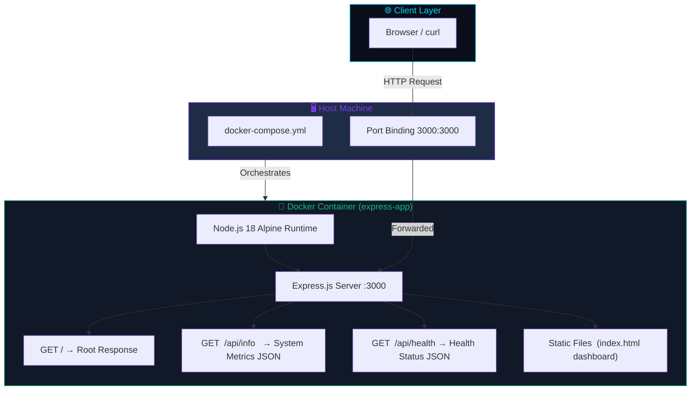
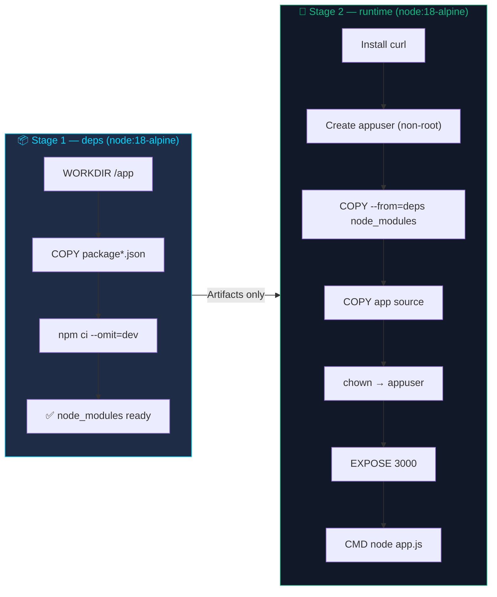
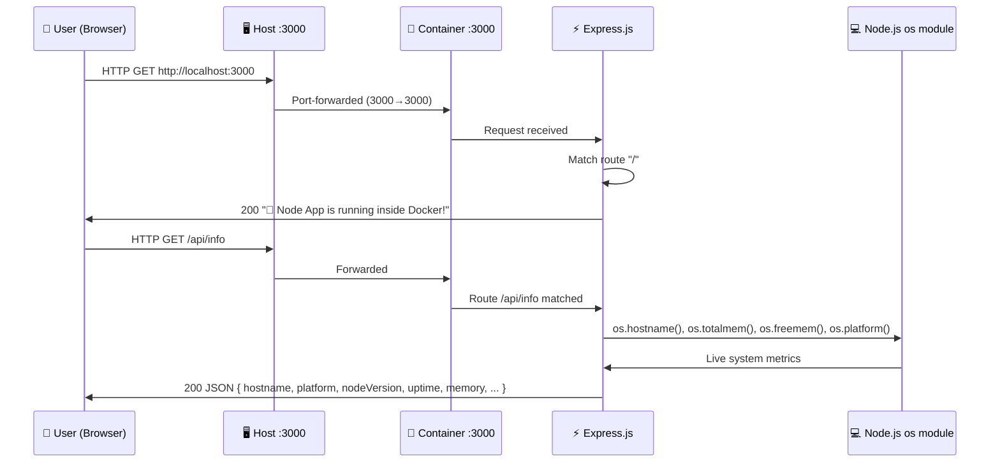
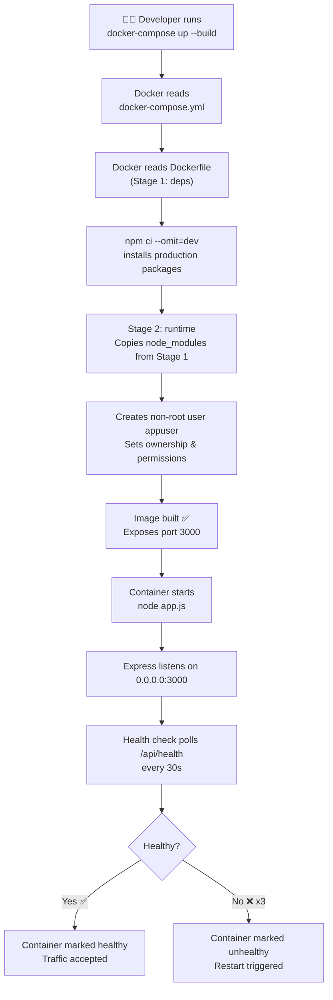

<div align="center">

<!-- Animated Banner -->


<br/>

[](https://nodejs.org/)
[](https://expressjs.com/)
[](https://www.docker.com/)
[](https://docs.docker.com/compose/)
[](https://alpinelinux.org/)
[](LICENSE)
[]()

<br/>

> 🚀 **A fully containerized, production-grade Node.js Express web application** built with Docker multi-stage builds, health checks, non-root security hardening, and real-time system monitoring — ready to deploy anywhere in seconds.

<br/>

[📖 Overview](#-project-overview) · [🏗️ Architecture](#️-architecture-overview) · [⚡ Quick Start](#-quick-start) · [🐳 Docker Guide](#-docker-deployment) · [📡 API Docs](#-api-documentation) · [🔒 Security](#-security-implementation) · [🛠️ Troubleshooting](#️-troubleshooting-guide)

</div>

---

## 📋 Table of Contents

- [📖 Project Overview](#-project-overview)
- [🏗️ Architecture Overview](#️-architecture-overview)
- [📁 Project Structure](#-project-structure)
- [🧰 Technology Stack](#-technology-stack)
- [🔄 Application Flow](#-application-flow)
- [🌍 Environment Variables](#-environment-variables)
- [✅ Prerequisites](#-prerequisites)
- [⚡ Quick Start](#-quick-start)
- [💻 Run Locally (Without Docker)](#-run-locally-without-docker)
- [🐳 Docker Deployment](#-docker-deployment)
- [📡 API Documentation](#-api-documentation)
- [🔒 Security Implementation](#-security-implementation)
- [🧪 Testing](#-testing)
- [📊 Monitoring & Logging](#-monitoring--logging)
- [🛠️ Troubleshooting Guide](#️-troubleshooting-guide)
- [🖼️ Screenshots / Output](#️-screenshots--output)
- [🚀 Future Enhancements](#-future-enhancements)
- [👤 Author](#-author)
- [📄 License](#-license)

---

## 📖 Project Overview

### What is this project?

**Docker · Node.js App** is a lightweight yet production-hardened **Express.js web server** containerized with **Docker** using an industry-standard **multi-stage build** pattern. It exposes a system-info dashboard UI and REST API endpoints that report live container metrics — hostname, platform, Node.js version, uptime, and memory usage.

### 🌍 Real-World Use Case

This project mirrors how engineering teams deploy microservices in real-world cloud environments:

- ✅ Serves as a **health-check-ready backend microservice** in a Kubernetes cluster
- ✅ Acts as a **sidecar container** reporting runtime diagnostics
- ✅ Demonstrates **container-first development practices** for DevOps pipelines
- ✅ Works as a **portfolio-grade template** for containerizing any Node.js application

### ✨ Key Features

| Feature | Description |
|---|---|
| 🐳 **Multi-Stage Docker Build** | Separates dependency installation from runtime, producing a minimal final image |
| 🔐 **Non-Root Container User** | Runs as `appuser` — follows the principle of least privilege |
| 💓 **Built-in Health Checks** | Docker and Docker Compose both poll `/api/health` every 30 seconds |
| 📊 **System Info API** | Returns live hostname, memory, uptime, Node version from within the container |
| 🎨 **Dark-Mode Dashboard UI** | Animated, responsive frontend with real-time data fetch |
| 🔄 **Auto-Restart Policy** | `restart: unless-stopped` ensures the container self-heals on crashes |
| 🪶 **Alpine Linux Base** | Ultra-slim ~50MB base image reduces attack surface and build time |

---

## 🏗️ Architecture Overview



### Multi-Stage Docker Build Architecture



> **Why multi-stage?** The final image contains **zero build tools** — only production `node_modules` and app source. This cuts the image size by ~60% vs a single-stage build and eliminates unnecessary tooling from the attack surface.

---

## 📁 Project Structure

```
Task_1(Containerize a Web Application)/
│
├── 📄 app.js                  ← Express server entry point
├── 🌐 index.html              ← Frontend dashboard (served as static file)
├── 🐳 Dockerfile              ← Multi-stage Docker build instructions
├── 🐙 docker-compose.yml      ← Multi-service orchestration config
├── 🚫 .dockerignore           ← Files excluded from Docker build context
├── 📦 package.json            ← Project metadata and npm scripts
├── 🔒 package-lock.json       ← Exact dependency version lockfile
└── 📂 node_modules/           ← Installed npm dependencies (not in image)
```

### File-by-File Explanation

---

#### `app.js` — Application Entry Point
> The heart of the application. Initializes the Express server, registers all routes, and starts listening on port `3000`.

```
Routes Registered:
  GET /            → Plain-text "app is running" response
  GET /api/info    → JSON payload of live system metrics
  GET /api/health  → JSON health-check response { status: 'ok' }
  Static /         → Serves index.html from the working directory
```

**Interactions:** Read by `node` at runtime. Referenced by `Dockerfile` as the `CMD` entrypoint. Health-check endpoint polled by both `Dockerfile` `HEALTHCHECK` and `docker-compose.yml`.

---

#### `index.html` — Frontend Dashboard
> A self-contained, single-file animated dark-mode dashboard. Uses vanilla JavaScript to fetch `/api/info` on load and render live container metrics with CSS animations, Grid backgrounds, and badge-style stat cards.

**No build step required** — it's pure HTML/CSS/JS served directly by Express's static middleware.

**Interactions:** Served by `app.js` via `express.static('.')`. Fetches from `/api/info` via `fetch()` in browser.

---

#### `Dockerfile` — Container Build Instructions
> Defines exactly how the application is packaged into a Docker image. Uses a **two-stage build**:

| Stage | Base Image | Purpose |
|---|---|---|
| `deps` | `node:18-alpine` | Install only production npm packages |
| `runtime` | `node:18-alpine` | Copy artifacts, harden security, expose port |

Key decisions:
- `npm ci --omit=dev` — reproducible install, dev deps excluded
- `adduser appuser` — non-root execution
- `HEALTHCHECK` — Docker daemon polls `/api/health` every 30s
- `ENV NODE_ENV=production` — tells Express to run in production mode

**Interactions:** Used by `docker build` and `docker-compose build`. References `package.json`, `app.js`, `index.html`.

---

#### `docker-compose.yml` — Service Orchestration
> Declares the `web` service, maps ports, injects environment variables, sets the restart policy, and configures the health check. In a multi-service setup you would add `db:`, `redis:`, etc. here.

**Interactions:** Reads `Dockerfile` via `build.context`. Exposes port `3000` to the host. Sets `NODE_ENV` and `CONTAINERIZED` env vars inside the container.

---

#### `.dockerignore` — Build Context Filter
> Prevents listed files/folders from being sent to the Docker daemon during `docker build`. This is critical for performance and security.

```
node_modules   ← Rebuilt inside container; never copy from host
.env           ← Secrets must never be baked into an image
.git           ← Version-control metadata is irrelevant in runtime
*.md           ← Documentation files not needed at runtime
npm-debug.log  ← Debug logs should not be in production images
```

**Interactions:** Docker CLI reads this before sending build context. Reduces image build time and final image size.

---

#### `package.json` — Project Manifest
> Defines the project name, version, npm scripts (`start`, `dev`), production dependencies (`express`), and required Node.js engine version (`>=18`).

**Interactions:** Used by `npm ci` in the `deps` Dockerfile stage. Referenced by `package-lock.json` for version pinning.

---

#### `package-lock.json` — Dependency Lockfile
> Records the exact resolved version, integrity hash, and download URL of every dependency (and transitive dependency). Ensures identical installs across all environments — local, CI, Docker.

**Interactions:** Used exclusively by `npm ci`. Must be committed to version control.

---

## 🧰 Technology Stack

| Component | Technology | Version | Purpose |
|---|---|---|---|
| **Runtime** | Node.js | 18 LTS | JavaScript server-side execution environment |
| **Framework** | Express.js | 4.18.2 | HTTP routing, middleware, static file serving |
| **Frontend** | Vanilla HTML/CSS/JS | — | Animated dashboard UI, no build step needed |
| **Containerization** | Docker | 20+ | Image build, packaging, and isolation |
| **Orchestration** | Docker Compose | v3 | Multi-service definition and lifecycle management |
| **Base Image** | Alpine Linux | 3.x (via node:18-alpine) | Minimal OS, ~5MB, reduced attack surface |
| **Security** | Non-root user | — | Runs as `appuser`, not `root` |
| **Health Checks** | curl + `/api/health` | — | Liveness probing by Docker daemon |
| **Package Manager** | npm (with lockfile) | — | Reproducible dependency installation via `npm ci` |

---

## 🔄 Application Flow

### 1. User Request Flow



### 2. Docker Build & Deploy Flow



### 3. API Request Processing Flow

```
Browser Request
    │
    ▼
Express.js Router
    │
    ├─── GET /           → res.send("🚀 Node App is running...")
    │
    ├─── GET /api/info   → Collect os.* metrics → res.json({...})
    │
    ├─── GET /api/health → res.json({ status: 'ok', timestamp })
    │
    └─── Static Files    → serve index.html from WORKDIR
```

---

## 🌍 Environment Variables

| Variable | Description | Required | Default |
|---|---|---|---|
| `NODE_ENV` | Sets Express runtime mode. `production` disables verbose error stack traces and enables performance optimisations | ✅ Yes | `development` |
| `CONTAINERIZED` | Custom flag read by `/api/info` to indicate the app is running inside a container | ⬜ Optional | `false` |
| `PORT` | (Not currently used — hardcoded to `3000`) Override if needed in future refactoring | ⬜ Optional | `3000` |

### How to Set Environment Variables

**Via docker-compose.yml (recommended):**
```yaml
environment:
  - NODE_ENV=production
  - CONTAINERIZED=true
```

**Via docker run:**
```bash
docker run -e NODE_ENV=production -e CONTAINERIZED=true -p 3000:3000 docker-express-app
```

**Via .env file (create locally, never commit):**
```bash
# .env
NODE_ENV=production
CONTAINERIZED=true
```

> ⚠️ **Never commit `.env` files.** They are listed in `.dockerignore` and should be in `.gitignore` as well.

---

## ✅ Prerequisites

Ensure the following tools are installed before proceeding:

| Tool | Minimum Version | Install Guide | Purpose |
|---|---|---|---|
| **Git** | 2.x | [git-scm.com](https://git-scm.com/) | Clone the repository |
| **Node.js** | 18 LTS | [nodejs.org](https://nodejs.org/) | Run app locally without Docker |
| **npm** | 9.x (bundled with Node) | Bundled | Install dependencies |
| **Docker** | 20.x | [docs.docker.com/get-docker](https://docs.docker.com/get-docker/) | Build and run containers |
| **Docker Compose** | v2.x | Bundled with Docker Desktop | Orchestrate multi-service environments |

### Verify Your Setup

```bash
git --version          # git version 2.x.x
node --version         # v18.x.x
npm --version          # 9.x.x
docker --version       # Docker version 20.x.x
docker compose version # Docker Compose version v2.x.x
```

---

## ⚡ Quick Start

> Get the app running in under 60 seconds with Docker:

```bash
# 1. Clone the repository
git clone https://github.com/your-username/docker-express-app.git
cd docker-express-app

# 2. Build & start with Docker Compose
docker compose up --build

# 3. Open in browser
open http://localhost:3000
```

That's it! 🎉

---

## 💻 Run Locally (Without Docker)

If you want to run the app directly on your machine without containers:

### Step 1 — Clone the Repository

```bash
git clone https://github.com/your-username/docker-express-app.git
cd docker-express-app
```

> **What this does:** Downloads all project files to a local directory and navigates into it.

### Step 2 — Install Dependencies

```bash
npm install
```

> **What this does:** Reads `package.json` and installs Express (and any other listed dependencies) into `node_modules/`. Uses `package-lock.json` for reproducible resolution.

### Step 3 — Start the Development Server

```bash
npm start
```

> **What this does:** Runs `node app.js` — starts the Express HTTP server on port 3000.

**Expected output:**
```
🚀 Server running on http://0.0.0.0:3000
```

### Step 4 — Verify

```bash
curl http://localhost:3000
# 🚀 Node App is running inside Docker!

curl http://localhost:3000/api/health
# {"status":"ok","timestamp":"2026-04-17T16:00:00.000Z"}

curl http://localhost:3000/api/info
# {"hostname":"your-machine","platform":"linux","nodeVersion":"v18.x.x",...}
```

Open `http://localhost:3000` in your browser to see the animated dashboard. 🖥️

---

## 🐳 Docker Deployment

### Option A — Docker Compose (Recommended)

#### Build & Start

```bash
docker compose up --build
```

> **`--build`** forces Docker to rebuild the image even if a cached version exists. Safe to run every time. Without it, changes to source files won't be reflected.

#### Start in Detached (Background) Mode

```bash
docker compose up --build -d
```

> **`-d`** (detached) runs containers in the background, freeing your terminal. Logs are still accessible via `docker compose logs`.

#### Stop Containers

```bash
docker compose down
```

> Stops and removes containers + default network. Does NOT remove the built image.

#### View Logs

```bash
docker compose logs -f web
```

> **`-f`** (follow) streams live logs. Replace `web` with the service name from `docker-compose.yml`.

---

### Option B — Raw Docker Commands

#### Step 1 — Build the Image

```bash
docker build -t docker-express-app .
```

> **What this does:**
> - `.` tells Docker to use the current directory as the build context
> - `-t docker-express-app` tags the resulting image with a human-readable name
> - Docker reads `Dockerfile`, executes all `RUN`, `COPY`, and `ENV` instructions layer-by-layer
> - Multi-stage: Stage 1 (`deps`) installs packages; Stage 2 (`runtime`) creates the lean final image

#### Step 2 — Run the Container

```bash
docker run -d \
  --name express-app \
  -p 3000:3000 \
  -e NODE_ENV=production \
  -e CONTAINERIZED=true \
  --restart unless-stopped \
  docker-express-app
```

| Flag | Meaning |
|---|---|
| `-d` | Run in detached (background) mode |
| `--name express-app` | Assign a human-readable name to the container |
| `-p 3000:3000` | Map host port 3000 → container port 3000 |
| `-e NODE_ENV=production` | Set environment variable inside container |
| `--restart unless-stopped` | Auto-restart on crash or host reboot |

#### Step 3 — Verify the Container is Running

```bash
docker ps
```

Expected output:
```
CONTAINER ID   IMAGE                STATUS                   PORTS                    NAMES
a1b2c3d4e5f6   docker-express-app   Up 2 minutes (healthy)   0.0.0.0:3000->3000/tcp   express-app
```

The `(healthy)` status confirms the health check endpoint is responding correctly.

---

### Docker Image Internals

```bash
# Inspect the final image layers and size
docker image inspect docker-express-app

# Check image size (should be ~180–220 MB for node:18-alpine)
docker images docker-express-app

# Get a shell inside a running container (for debugging)
docker exec -it express-app sh
```

---

## 📡 API Documentation

Base URL: `http://localhost:3000`

### Endpoints

| Method | Endpoint | Description | Auth Required |
|---|---|---|---|
| `GET` | `/` | Root health string | ❌ No |
| `GET` | `/api/health` | Liveness probe for container orchestrators | ❌ No |
| `GET` | `/api/info` | Live system metrics from inside the container | ❌ No |
| `GET` | `/*` (static) | Serves `index.html` dashboard | ❌ No |

---

### `GET /`

Returns a plain-text confirmation that the server is alive.

**Request:**
```bash
curl http://localhost:3000/
```

**Response `200 OK`:**
```
🚀 Node App is running inside Docker!
```

---

### `GET /api/health`

Lightweight health-check endpoint polled by Docker every 30 seconds. Returns `200` as long as the process is alive.

**Request:**
```bash
curl http://localhost:3000/api/health
```

**Response `200 OK`:**
```json
{
  "status": "ok",
  "timestamp": "2026-04-17T16:23:00.000Z"
}
```

| Field | Type | Description |
|---|---|---|
| `status` | `string` | Always `"ok"` when the server is responsive |
| `timestamp` | `string` | ISO 8601 UTC timestamp of the response |

---

### `GET /api/info`

Returns live system metrics collected from Node.js's built-in `os` module and `process` global.

**Request:**
```bash
curl http://localhost:3000/api/info
```

**Response `200 OK`:**
```json
{
  "hostname": "a1b2c3d4e5f6",
  "platform": "linux",
  "nodeVersion": "v18.20.2",
  "uptime": 142,
  "memory": {
    "total": 7872,
    "free": 5310
  },
  "environment": "production",
  "containerized": "true"
}
```

| Field | Type | Source | Description |
|---|---|---|---|
| `hostname` | `string` | `os.hostname()` | Container ID (Docker sets hostname = container short ID) |
| `platform` | `string` | `os.platform()` | OS platform (`linux` inside Docker) |
| `nodeVersion` | `string` | `process.version` | Node.js runtime version |
| `uptime` | `number` | `process.uptime()` | Seconds the process has been running |
| `memory.total` | `number` | `os.totalmem()` | Total system memory in MB |
| `memory.free` | `number` | `os.freemem()` | Available system memory in MB |
| `environment` | `string` | `process.env.NODE_ENV` | Runtime environment mode |
| `containerized` | `string` | `process.env.CONTAINERIZED` | Custom flag — `"true"` when running in Docker |

---

## 🔒 Security Implementation

This project implements several Docker security best practices:

### 1. Non-Root User Execution

```dockerfile
RUN addgroup -S appgroup && adduser -S appuser -G appgroup
# ...
USER appuser
```

> **Why:** Containers run as `root` by default. If an attacker exploits a vulnerability, root access inside the container could allow escaping to the host. Running as an unprivileged user limits the blast radius.

### 2. Multi-Stage Build — Zero Dev Tool Leakage

The final image contains **only**:
- Node.js 18 Alpine runtime
- Production `node_modules` (no `devDependencies`)
- Application source files

**Not included:** npm, build tools, shell utilities beyond `sh` and `curl`.

### 3. `.dockerignore` — Secrets Never Reach the Image

```
.env
.git
node_modules
npm-debug.log
```

> **Why:** Build context is sent to the Docker daemon. Without `.dockerignore`, secrets in `.env` and your entire Git history would be baked into the image layer cache.

### 4. Alpine Linux Base Image

`node:18-alpine` is based on Alpine Linux, which ships with:
- **musl libc** (not glibc) — fewer pre-installed packages
- **No shell scripts, cron, SSH** by default
- Significantly smaller CVE surface area vs Debian/Ubuntu-based images

### 5. Pinned Dependency Versions

`package-lock.json` + `npm ci` ensures every build installs the **exact same byte-for-byte packages** — preventing supply-chain attacks via version drift.

### 6. Health Check — Fail Fast

```dockerfile
HEALTHCHECK --interval=30s --timeout=10s --start-period=5s --retries=3 \
  CMD curl -f http://localhost:3000/api/health || exit 1
```

> Docker marks the container `unhealthy` after 3 failed probes and can trigger a restart — ensuring degraded containers are automatically cycled out.

### Security Hardening Checklist

- [x] Non-root container user
- [x] Multi-stage build (no dev tools in prod image)
- [x] `.dockerignore` excludes secrets and `.git`
- [x] Alpine base (minimal OS)
- [x] Pinned lockfile (`npm ci` not `npm install`)
- [x] Health check configured
- [x] `restart: unless-stopped` for availability
- [ ] Image vulnerability scanning with Trivy *(recommended addition)*
- [ ] Read-only root filesystem (`--read-only`) *(recommended addition)*
- [ ] Docker Content Trust / image signing *(recommended addition)*

### Recommended: Add Trivy Vulnerability Scanning

```bash
# Install Trivy
brew install aquasecurity/trivy/trivy   # macOS
# or
docker pull aquasec/trivy

# Scan the built image
trivy image docker-express-app

# Scan in CI/CD pipeline
trivy image --exit-code 1 --severity HIGH,CRITICAL docker-express-app
```

---

## 🧪 Testing

The project currently relies on manual API verification. The following testing strategy is recommended for production maturity:

### Manual Smoke Tests

```bash
# 1. Verify root response
curl -s http://localhost:3000/
# Expected: 🚀 Node App is running inside Docker!

# 2. Verify health check
curl -s http://localhost:3000/api/health | jq .
# Expected: { "status": "ok", "timestamp": "..." }

# 3. Verify system info
curl -s http://localhost:3000/api/info | jq .
# Expected: { "hostname": "...", "platform": "linux", ... }

# 4. Verify Docker health status
docker inspect --format='{{.State.Health.Status}}' express-app
# Expected: healthy
```

### Recommended: Unit Tests with Jest

```bash
npm install --save-dev jest supertest

# Create test file: app.test.js
# Run tests:
npm test
```

**Sample test structure:**
```javascript
const request = require('supertest');
const app = require('./app');

describe('API Endpoints', () => {
  test('GET / returns 200', async () => {
    const res = await request(app).get('/');
    expect(res.statusCode).toBe(200);
  });

  test('GET /api/health returns ok', async () => {
    const res = await request(app).get('/api/health');
    expect(res.body.status).toBe('ok');
  });

  test('GET /api/info returns hostname', async () => {
    const res = await request(app).get('/api/info');
    expect(res.body).toHaveProperty('hostname');
    expect(res.body).toHaveProperty('nodeVersion');
  });
});
```

---

## 📊 Monitoring & Logging

### Application Logs

Express.js logs are written to `stdout`/`stderr` — Docker captures these automatically.

### View Container Logs

```bash
# Follow live logs
docker logs -f express-app

# Last 50 lines
docker logs --tail 50 express-app

# Logs with timestamps
docker logs -t express-app

# Via Docker Compose
docker compose logs -f web
```

### Inspect Container Health History

```bash
docker inspect --format='{{json .State.Health}}' express-app | jq .
```

**Sample output:**
```json
{
  "Status": "healthy",
  "FailingStreak": 0,
  "Log": [
    {
      "Start": "2026-04-17T16:23:30Z",
      "End": "2026-04-17T16:23:30Z",
      "ExitCode": 0,
      "Output": "..."
    }
  ]
}
```

### Container Resource Usage

```bash
# Live CPU, Memory, Network stats
docker stats express-app

# One-time snapshot
docker stats --no-stream express-app
```

### Recommended Monitoring Stack

For production environments, add:

| Tool | Purpose |
|---|---|
| **Prometheus** | Metrics scraping and time-series storage |
| **Grafana** | Dashboard visualization |
| **Loki** | Log aggregation |
| **Alertmanager** | Alert routing and notifications |

---

## 🛠️ Troubleshooting Guide

### Common Issues & Solutions

---

#### 🔴 Port `3000` Already in Use

**Symptom:**
```
Error: bind: address already in use :::3000
```

**Cause:** Another process is already listening on port 3000.

**Solution:**
```bash
# Find and kill the process using port 3000
lsof -ti:3000 | xargs kill -9

# OR change the host port mapping (app still runs on :3000 inside container)
# In docker-compose.yml:
ports:
  - "3001:3000"   # ← use port 3001 on host instead
```

---

#### 🔴 Docker Build Fails — `npm ci` Error

**Symptom:**
```
npm ERR! cipm can only install packages with an existing package-lock.json
```

**Cause:** `package-lock.json` is missing or not in the build context.

**Solution:**
```bash
# Ensure package-lock.json exists
npm install   # generates package-lock.json if missing
git add package-lock.json
docker compose up --build
```

---

#### 🔴 Container Shows `(unhealthy)` Status

**Symptom:**
```
express-app   Up 2 minutes (unhealthy)
```

**Cause:** The `/api/health` endpoint is not responding within the timeout window.

**Solution:**
```bash
# Check what's happening inside the container
docker logs express-app

# Manually test the health endpoint inside the container
docker exec express-app curl -f http://localhost:3000/api/health

# Inspect full health check history
docker inspect --format='{{json .State.Health.Log}}' express-app | jq .
```

---

#### 🔴 Permission Denied Error in Container

**Symptom:**
```
Error: EACCES: permission denied, open '/app/somefile'
```

**Cause:** File ownership wasn't set correctly in the Dockerfile.

**Solution:** Ensure the `chown` line is present in your Dockerfile:
```dockerfile
RUN chown -R appuser:appgroup /app
USER appuser
```

---

#### 🔴 `docker compose` Command Not Found

**Symptom:**
```
bash: docker compose: command not found
```

**Cause:** Older Docker installations use `docker-compose` (with hyphen) as a separate binary.

**Solution:**
```bash
# Use legacy syntax
docker-compose up --build

# OR upgrade Docker to v20+ which bundles Compose as a plugin
```

---

#### 🔴 Changes to `app.js` Not Reflected After `docker compose up`

**Symptom:** Code changes aren't visible after restarting.

**Cause:** Docker used a cached image layer.

**Solution:**
```bash
# Force a full rebuild with no cache
docker compose up --build --force-recreate

# Or rebuild with no cache at all
docker compose build --no-cache
docker compose up
```

---

## 🖼️ Screenshots / Output

### Application Dashboard

> *Screenshot placeholder — run the app and visit `http://localhost:3000` to see the animated dark-mode system info dashboard.*

```
┌─────────────────────────────────────────────┐
│  🐳  Docker · Node.js App                   │
│                                             │
│  ┌──────────┐  ┌──────────┐  ┌──────────┐  │
│  │ Hostname │  │ Platform │  │ Node ver │  │
│  │ a1b2c3d4 │  │  linux   │  │ v18.20.2 │  │
│  └──────────┘  └──────────┘  └──────────┘  │
│                                             │
│  ┌──────────┐  ┌──────────┐  ┌──────────┐  │
│  │  Uptime  │  │ Mem Total│  │ Mem Free │  │
│  │  142 sec │  │ 7872 MB  │  │ 5310 MB  │  │
│  └──────────┘  └──────────┘  └──────────┘  │
└─────────────────────────────────────────────┘
```

### Running Containers (`docker ps`)

```
CONTAINER ID   IMAGE                STATUS                   PORTS                    NAMES
a1b2c3d4e5f6   docker-express-app   Up 2 minutes (healthy)   0.0.0.0:3000->3000/tcp   express-app
```

### Docker Health Check

```bash
$ docker inspect --format='{{.State.Health.Status}}' express-app
healthy
```

---

## 🚀 Future Enhancements

| Priority | Enhancement | Description |
|---|---|---|
| 🔴 High | **Kubernetes Deployment** | Add `k8s/` manifests: Deployment, Service, ConfigMap, HPA for auto-scaling |
| 🔴 High | **GitHub Actions CI/CD** | Automate build → test → Trivy scan → push to Docker Hub on every PR |
| 🟡 Medium | **Trivy Security Scanning** | Integrate `aquasecurity/trivy-action` into CI pipeline for CVE detection |
| 🟡 Medium | **Prometheus Metrics** | Expose `/metrics` endpoint using `prom-client` for observability |
| 🟡 Medium | **Environment-specific configs** | Add `.env.example`, `dotenv` support, and config validation with `joi` |
| 🟢 Low | **Read-only Filesystem** | Add `--read-only` container flag with explicit tmpfs mounts |
| 🟢 Low | **Docker Content Trust** | Sign images with `DOCKER_CONTENT_TRUST=1` before pushing |
| 🟢 Low | **Unit + Integration Tests** | Add Jest test suite with Supertest for full API coverage |
| 🟢 Low | **Rate Limiting** | Add `express-rate-limit` middleware to prevent abuse |
| 🟢 Low | **Structured Logging** | Replace `console.log` with Winston or Pino for JSON-formatted logs |

---

## 👤 Author

<div align="center">

| | |
|---|---|
| **Name** | Your Name |
| **GitHub** | [@your-username](https://github.com/your-username) |
| **LinkedIn** | [linkedin.com/in/your-profile](https://linkedin.com/in/your-profile) |
| **Portfolio** | [yourwebsite.com](https://yourwebsite.com) |

</div>

---

## 📄 License

```
MIT License

Copyright (c) 2026 Your Name

Permission is hereby granted, free of charge, to any person obtaining a copy
of this software and associated documentation files (the "Software"), to deal
in the Software without restriction, including without limitation the rights
to use, copy, modify, merge, publish, distribute, sublicense, and/or sell
copies of the Software, and to permit persons to whom the Software is
furnished to do so, subject to the following conditions:

The above copyright notice and this permission notice shall be included in all
copies or substantial portions of the Software.

THE SOFTWARE IS PROVIDED "AS IS", WITHOUT WARRANTY OF ANY KIND, EXPRESS OR
IMPLIED, INCLUDING BUT NOT LIMITED TO THE WARRANTIES OF MERCHANTABILITY,
FITNESS FOR A PARTICULAR PURPOSE AND NONINFRINGEMENT. IN NO EVENT SHALL THE
AUTHORS OR COPYRIGHT HOLDERS BE LIABLE FOR ANY CLAIM, DAMAGES OR OTHER
LIABILITY, WHETHER IN AN ACTION OF CONTRACT, TORT OR OTHERWISE, ARISING FROM,
OUT OF OR IN CONNECTION WITH THE SOFTWARE OR THE USE OR OTHER DEALINGS IN THE
SOFTWARE.
```

---

<div align="center">


**⭐ If this project helped you, please give it a star on GitHub!**

[](https://github.com/your-username/docker-express-app)

*Built with ❤️ using Node.js, Express, and Docker*

</div>